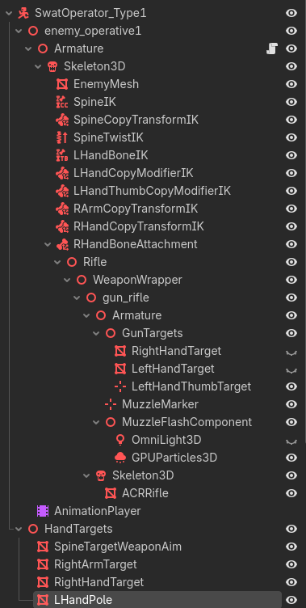

## Enemy IK

### This is a general overview of how I implemented the enemy IK. First we'll talk about the actual editor work and then we will talk about the code.

- This is how the node structure looks like:  

#### From what I understand:
  - We use the CopyTransformModifier3D to basically copy certain parts of the transform like either rotation or position or scale of a particular bone.
  - BoneAttachment3D to move a certain child node along with the bone set in the node.
  - The HandTargets 

## Hands setup

- The important part is here TwoBoneIK3D, which takes a target node and a pole node. We use this for the left hand only here. The target node refers to the grip point on the rifle
  The target is placed inside the weapon because I want the left hand to follow that hold point whenever the gun moves. The pole is for the elbow movement. This is purely for rotation.
  This is the purpose of the LHandBoneIK. Now for rotating the hand itself, we use LHandCopyModifierIK which is of type CopyTransformModifier3D which also takes the left hand target

- I also added another CopyTransformModifier3D for rotating the thumb so that it's placed correctly on the rifle. You can do the same for the other fingers if you want to.
  It's named LHandThumbCopyModifierIK as shown in the photo.

- For the right hand, we use a bone attachment and then insert the weapon inside there. We don't use a TwoBoneIK3D for the right hand, because
  the right hand is the primary hand that holds the weapon and thus the weapon moves along with the right hand. Initially we have to position 
  the gun into the right hand to match the position so that later we can use copy transforms to rotate and modify the right arm and hand. 
  Now the important part here is that, all the animations are coming from the enemy character itself (for now until we have reload and other weapon-specific anims)

- We also setup a couple more CopyTransform3D for the right arm and hand. This is purely for rotation only.
  The RArmCopyTransformIK, RHandCopyTransformIK are mainly for aiming at the player. We can use this to rotate the arms and hands if we are in situations like cover or maybe aiming
  This part is still something I'm trying to figure out.

## Spine setup
- The spine stuff is well....self-explaintory. We use a CCDIK3D (I named it SpineIK in the editor). We put the target above the character.
  It takes a start bone and end bone. We move from the spine all the way to top of the head. We can adjust the joint's limitation if we want to.
- You can do things like peeking, bend your upper body and etc...The position of the target allows you to do that. Rotation makes it look weird and I didn't really touch the scale

- Now the SpineCopyTransformIK (of type CopyTransformIK3D). Now this is for turning in place. Say the enemy needs to turn around 45deg or 135deg or etc...Here we use the same target
  as we used for the SpineIK but instead only for the rotation of the chest. Without this, the turning would look really weird.

- The last one is SpineTwistIK (of type BoneTwistDisperser3D) which from the docs is for "Allows for smooth twist interpolation between multiple bones". I didn't really see any difference
  with and without it. So I won't talk about it now.
